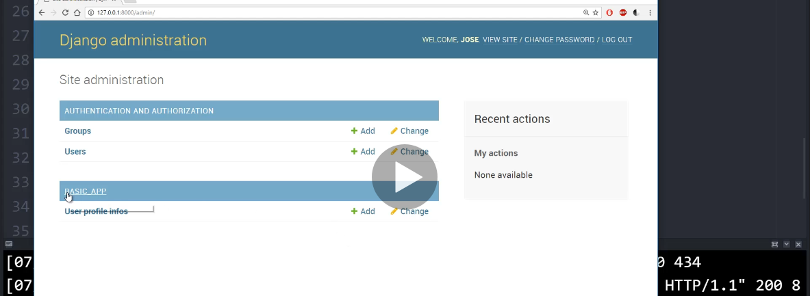
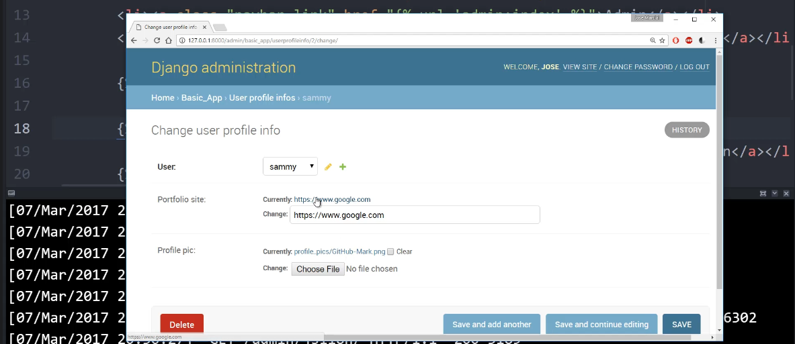

## Screenshots from the lectures 

### Passwords
  
  
  
  
  
  
  
  
  
**sha hash example**  
  
**start a project and an app. make sure you have these in settings.py**  
  
  
### How to pass in the different algorithms for hashing
  
  
  
**list of password hashers**  
  
**there are many options for password validators (check documentation). the example shows that the password should have a minumum of 9 characters**  
  
  
  
### User Models
  
  
  
  
  
  
  
  
  
  
  
  
  
  
  
  
  
**create a new folder called profile_pics under the media folder**  
  
  
  
  
**screenshot taken from the corrected notes. class renamed to UserProfileInfoForm from UserProfileInfo**  
  
  
  
**before continuing below, create pages base.html, index.html, registration.html and login.html under templates/basic_app**  
  
  
  
  
  
  
  
  
  
  
  
  
  
  
  
  
  
  
  
  
  
  
  
  
  
  
  
  
  
  
  
  
  
  
  
  
  
  
  
  
  
  
  
  
  
  
  
  
  
  
  
  
  
  
  
  
  
  
