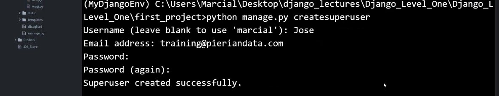
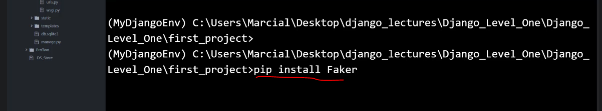
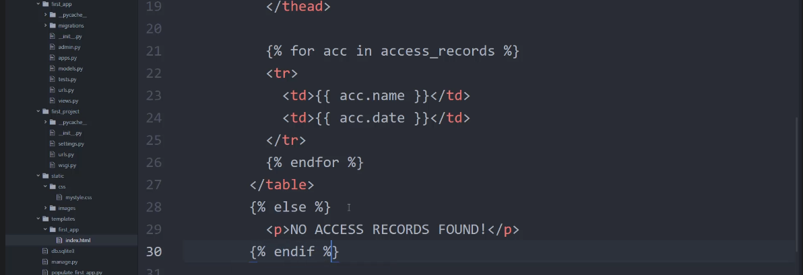

## Screenshots from the lectures 

  
  
## Models Overview
  
  
  
  
  
  
  
  
  
  
  
  
  
  
  
## Creating Models
  
  
  
  
  
  
  
  
  
**Add something to the model using shell. But using the admin interface is of course better**  
  
**Register the models in admin.py**  
  
**Create superuser**  
  
**Enter domainname.com/admin to go to the admin dashboard and enter the superuser username and password**  
  
  
## Population Scripts
  
  
  
**Faker will create a lot of fake data (emails, addresses, names etc) that we can use as test data**  
  
  
  
  
  
  
  
## Models-Templates-Views Paradigm
  
  
  
  
  
  
  
  
  
  
  
  
  
  
  

